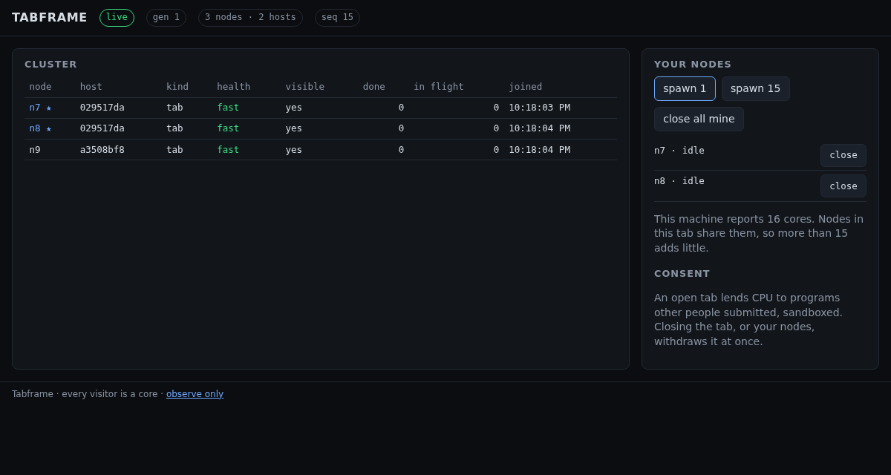

# WP0.10 — First public hello

**Milestone:** M0 · **Branch:** `wp/0.10-first-hello` · **Merged:** 2026-09-02

## What

The machine exists on AWS and a browser anywhere can be a node of it.

- `cdk bootstrap` and the first `cdk deploy` of four stacks: **Core** (buckets, CloudFront, pointer,
  fleet secret, the $100 budget), **Image** (the MicroVM image built by Lambda from the real
  control-plane bundle), **Fleet** (session and rotate functions), and the new **Web** stack
  (the page and its `config.json` in the web bucket, CloudFront invalidated).
- `mise run up` wrote the pointer, enabled the hourly rule, and rotate launched the first control
  plane MicroVM. The session function vends its endpoint and a shared 30-minute token.
- The page served from CloudFront fetches a session, connects to the MicroVM through the proxy with
  the token as a WebSocket subprotocol, and the tab's node says hello. A second browser sees it.

## How

- **Image staging.** `mise run build:image` bundles the control plane to one ESM file and stages
  `packages/infra/image-dist/` (Dockerfile, `package.json` with `"type": "module"`, `main.js`,
  `programs/`); `cdk deploy` reads it through `TABFRAME_IMAGE_DIR`. The committed placeholder
  directory still lets the image build before the bundle exists.
- **Image mode.** The image's environment sets `TABFRAME_MODE=image` and `TABFRAME_HOST=0.0.0.0`,
  so the process boots neutral, binds all interfaces inside the VM, and becomes a control plane on
  the `/run` hook with the generation, store base, and fleet secret from rotate's payload.
- **Web stack.** A `BucketDeployment` of `packages/web/dist` plus a generated `config.json`
  naming the session URL, with a CloudFront invalidation; it depends on Core and Fleet, so the
  order is Core → Image → Fleet → Web.
- **Endpoints without a scheme.** MicroVM endpoints are bare hosts; the node package's session
  parser prefixes `wss://` and accepts ISO timestamps for `expiresAt`.
- **Operator scripts** resolve the image ARN from the deployed stack's outputs rather than an
  environment variable, since the ARN embeds the account id and must not live in the repo.

## What deploying taught, all recorded in the design record's drift log

1. **No reserved concurrency at the account default.** CloudFormation refuses any reservation that
   would leave fewer than 10 unreserved executions, and the account has exactly 10. Both fleet
   functions run without reserved concurrency; rotate stays single-writer through its idempotent
   check and per-generation client token.
2. **The runtime's SDK predates MicroVMs.** `NodejsFunction` excludes `@aws-sdk/*` by default and
   the Lambda runtime's bundled SDK has no `client-lambda-microvms`; `bundleAwsSDK: true` fixes it.
3. **`iam:PassRole` with a `PassedToService` condition is not honored by `RunMicrovm`.** The
   condition was dropped; the grant is still limited to the one role.
4. **`RunMicrovm` also needs `lambda:PassNetworkConnector`** on the managed connectors, and a
   wildcard on their ARN pattern was still denied, so it is granted on `*`.
5. **URL-level CORS on the session function duplicated the handler's headers**; the URL now has
   none and the handler answers preflight and GET.
6. **The store base is the blob prefix** (`https://<distribution>/blob`), not the origin.
7. **IAM changes take a little while to reach a running function's role**: the first `up` after
   each policy change failed with the previous denial and succeeded on retry.

## Evidence

- `cdk deploy`: all four stacks green; the MicroVM image built from the real bundle.
- `mise run up` → `{"action":"launched", ..., "generation":1}`.
- Session function: `{endpoint, token, expiresAt, storeBase, generation}` with the token redacted;
  preflight from the page origin answers 204 with the origin echoed once.
- Through the proxy with an all-ports token: `/health` on 8081 → `role control-plane, mode image,
  generation 1`; `/diag` → DNS ok in about 100 ms from inside the VM, Node v22.22.3.
- Playwright against the deployed page (`TABFRAME_URL=https://<distribution>`): both tests pass —
  two tabs see each other's nodes, spawn and close propagate, observe-only lends none, a closed tab
  withdraws its node; the health route is not public.
- Screenshot above: the deployed page with three nodes across two hosts, generation 1.

## Dependencies introduced

| Package | Version | Why |
|---|---|---|
| `@aws-sdk/client-cloudformation` | 3.1124.0 | operator scripts and the verify runbook read stack outputs |
| `@aws-sdk/client-lambda`, `client-service-quotas` (infra) | 3.1124.0 | the verify runbook's account facts |

## Drift

Seven items above, mirrored in the design record's drift log.

## Open

- The MicroVM log group has streams but no events yet for the running control plane; the process
  logs JSON lines to stdout. Tracked for M4 operations; `/health` and `/diag` through the proxy
  cover M0.
- `mise run verify` (WP0.11) runs next against this deployment.
