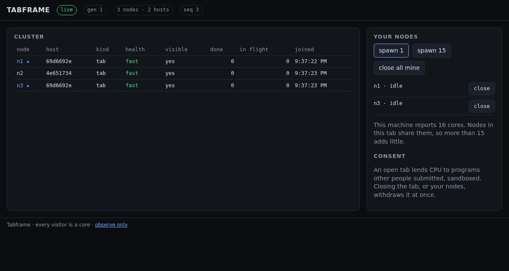

# WP0.6 — Web, minimal

**Milestone:** M0 · **Branch:** `wp/0.6-web` · **Merged:** 2026-09-01

## What

`packages/web` is the host page (design §3): one observer socket for the dashboard, zero or more
node workers, and the controls. The M0 version:

- **Session and machine state.** The page fetches `/config.json` for the session URL, then a
  session, and shows the machine as connecting, starting (a MicroVM booting from its snapshot),
  off (with the operator's `mise run up` hint), live, or outdated (reload once).
- **Observer client.** Subscribes, receives paged snapshots and sequence-numbered events, pings
  every two seconds, resubscribes on a sequence gap, and reconnects through a fresh session after
  any close, honoring a rotation's delay.
- **Cluster view.** Node table with id, host, kind, health, visibility, tasks done, in flight,
  joined time; header pills for generation, node and host counts, and the last sequence number.
  Nodes owned by this tab are starred.
- **Your nodes.** One node spawned on arrival unless the URL has `?observe`. Spawn 1, spawn
  cores-minus-one, per-node close, close all. A note states the machine's core count and why more
  nodes in one tab add little. Visibility changes are relayed to every worker.
- **Consent** text next to the controls.
- A `screenshot` script that starts a local control plane, drives the page, and writes evidence
  PNGs for the implementation log.

## How

- The bundle is two entry points, `host.js` and `node.js` (the worker, which is just the node
  platform re-exported), built by `packages/web/scripts/build.ts` under Bun with `--watch` for
  the dev loop; `public/` is copied alongside. Only entry points that exist are bundled, so the
  sandbox and editor entries can arrive later without touching the task.
- The cluster model (`state.ts`) is a pure reducer over observer messages: snapshot pages
  accumulate, events must arrive in sequence, and a skipped number or a pong ahead of the last
  event sets a `gap` flag the client turns into a resubscribe.
- The page has its own tsconfig with the DOM lib; the root project excludes it. `mise run lint`
  type-checks both.
- Playwright's web server is the real control plane in local mode on port 4090 serving the built
  bundle, so browser tests run against production code paths with nothing mocked.

## Why

- **Observer and node are separate sockets** (design §3): the dashboard never proxies a node, and
  a tab with `?observe` is a pure dashboard.
- **Gap detection from day one** (design §7.5): with sequence numbers already on every event, the
  client's "ask for a fresh snapshot rather than trust a stale view" path exists before task
  events make it matter.
- **Honest about cores**: the spawn default is cores minus one and the page says why, which is the
  rationale's point about in-app spawn being bounded by the visitor's machine.

## Evidence

- Playwright (`e2e/host.e2e.ts`), the WP's acceptance line: two tabs see each other's nodes and
  converge on "2 nodes · 2 hosts"; spawning in one tab is seen by the other; closing all of a tab's
  nodes withdraws them; an observe-only tab lends none; closing a tab removes its node from
  everyone's view; `/health` stays off the public port.
- `bun test`: 84 tests, four new for the state model (paging, sequence gaps, pong-ahead, replace
  on first page, unknown-node health ignored). Coverage stays at 100 % of measured lines; the web
  package is report-only by policy.
- `mise run lint` clean across both TypeScript projects. Screenshot above from the script.

## Dependencies introduced

None new; the page uses the node package's session and backoff modules, now exported.

## Drift

- The `build:web` task became a script rather than a bare `bun build` invocation, so it can copy
  static files, skip absent entries, and watch. Recorded in `mise.toml`.

## Open

None.
