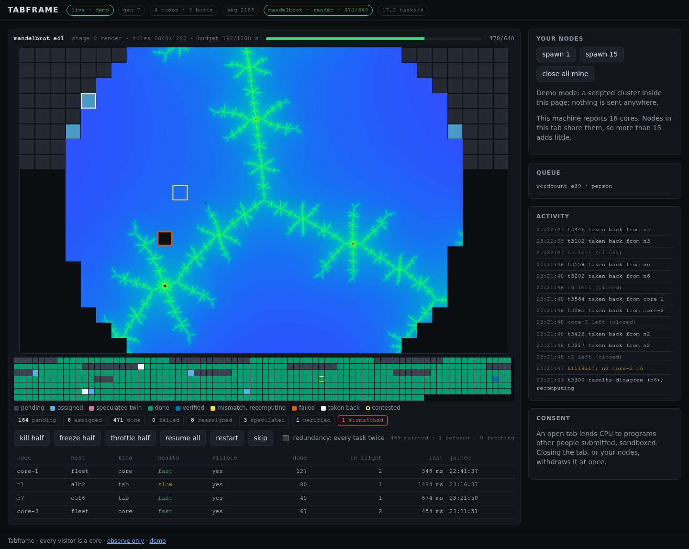

# WP1.8 — Dashboard v1

**Milestone:** M1 · **Branch:** `wp/1.8-dashboard-v1` · **Merged:** 2026-09-02

## What

The host page grew from a node table into the dashboard the design describes (§3 steps 3, 6 and
8; §6.7; §8.3). The canvas is the hero: finished tiles land on it as they are verified, and the
scheduler's state is drawn over the rectangles that are still open.

- **Cluster model.** `state.ts` now models everything the observer socket carries: the current
  execution with phase (planning, running, folding, done, failed), stage, canvas, counters, budget,
  failure reason and follow-up offer; the queue; the machine view (awake, redundancy); every task of
  the execution with holders, attempts, output hash, placement, contested and verified flags; a
  throughput window of `taskDone` arrival times; the last control's victims; rotation and sleep
  notices; announced programs; and an activity list of notable events. Gap detection on sequence
  numbers is unchanged.
- **Tiles view.** `tiles.ts` keeps an offscreen surface at the execution's canvas size in step with
  the state: a new execution or stage clears it; every settled tile is fetched once per output hash
  from the store, checked for size (width × height × 4) and re-hashed with SHA-256 before it is
  painted; wrong bytes or a wrong size are refused with an outline rather than shown; a retracted
  tile (mismatch) is wiped; a missing blob is retried after two seconds. The visible canvas shows the
  surface at half size with the overlay.
- **Overlay and grid.** Open rectangles are tinted by task state on the canvas itself; verified tiles
  get a blue mark, contested ones a yellow outline, refused ones an orange outline, and a task taken
  back from a node flashes white for 1.5 s. Below the canvas a compact grid shows one cell per task
  in index order with the same colors, so a `bars` or `text` program (whose tasks have no
  placement) still has a picture. The palette is Okabe–Ito, with luminance differences on top of hue.
- **Pills and counters.** Header: machine state, generation, nodes and hosts, sequence number,
  execution name · stage · done/total, and throughput over the last five seconds. Execution row:
  program, stage, view, canvas, budget, progress bar. Chips: the eight counters (pending, assigned,
  done, failed, reassigned, speculated, verified, mismatched).
- **Controls over the socket.** Kill half, freeze half, throttle half, resume all, restart, skip,
  and the redundancy checkbox go through `ObserverClient.send`, which stamps the envelope and spaces
  sends under the observer rate limit. `controlApplied` flashes the named nodes in the table and
  lands in the activity list.
- **Node table** adds last-task time; in-flight is derived from task holders so it never drifts from
  the grid. Queue and activity panels sit beside "Your nodes", which now shows tasks done and last
  time per local node.
- **Notices** for a control-plane rotation (next generation, reconnect delay), the machine going to
  sleep, and execution failure reasons. The waking, starting, off, and outdated states are unchanged.
- **Demo mode** (`?demo=1`): a scripted control plane inside the page feeds the reducer the same
  messages the wire carries and serves real Mandelbrot tiles from an in-memory store under their true
  hashes, so the fetch-and-verify path runs unchanged. The story: a straggler gets a speculative
  twin that agrees; a lying node's late result forces a retraction and recompute; one tile is served
  under the right hash with the wrong bytes and is refused; someone presses kill half and the
  released tasks flash back to pending; replacement nodes join; a tab goes silent; the control plane
  rotates mid-frame and the picture survives the new generation. `&speed=N` and `&pause=<tiles>`
  drive screenshots; the clock freezes on pause so flashes stay visible.

## How

- **Reducer semantics mirror the core's counters** (`packages/core/src/{scheduler,results}.ts`):
  `taskAssigned` moves pending → assigned, `taskSpeculated` adds a holder and counts a twin,
  `taskDone` settles and clears holders, `taskReassigned` releases only when the last holder is
  gone, `taskMismatch` retracts (done → pending, output withdrawn, contested), `taskFailed` closes
  the task. A node's `tasksDone` counts every result it handed in, duplicates included, as in the
  core. The reducer is copy-on-write per event; the page renders at most once per animation frame,
  the node table at most four times a second.
- **Rows the stage event cannot carry.** `stageStarted` carries at most 256 task rows. Task ids
  are handed out consecutively inside a stage, so the reducer records the numeric base of the ids it
  saw and places later rows from their id; ids that do not fit stay unplaced and are drawn after the
  placed ones. The next snapshot carries every row and settles it.
- **Resubscribe is a reconnect.** The core refuses a second `subscribe` on the same socket, and
  `since` is not implemented yet, so a sequence gap closes the socket and reconnects at once
  through a fresh session; the snapshot is the recovery. The tiles view keys its surface on
  execution, stage and canvas size, so a reconnect (or a rotation) repaints nothing that is already
  there.
- **Redundancy echo.** `controlApplied {op: "setRedundancy"}` carries no value and only a snapshot
  does. The page that toggled applies its own value at once and ignores the echo; any other observer
  refreshes quietly through a reconnect after a random delay of up to four seconds, so a room of
  observers does not hit the session function together.
- **Blob source.** Tiles are fetched from `<storeBase>/<hash>` of the session with `force-cache`,
  since blobs are immutable. `@tabframe/store` gained a `./hash` subpath export so the page pulls in
  `sha256Hex` without the S3 driver and its SDK.
- **Painter interface.** `TilePainter` (reset, put, flag, clear) separates the fetch-and-verify
  logic from the canvas, so it is unit-tested with a recorder under Bun, and the page implements it
  with an offscreen canvas plus `putImageData`.

## Why

- **Verification on the dashboard too** (design §7.2): the control plane only ever sees hashes; a
  store that serves other bytes, or a cache that went stale, is caught where the pixels are drawn.
  The refused outline is the honest display, not a blank.
- **The overlay on the canvas** makes the money shot legible without a second widget: when half
  the nodes die, the open rectangles flash on the picture where the missing tiles are.
- **Colorblind-safe states** with luminance separation, and monospace tabular numbers everywhere a
  number moves, per the taste note.
- **Controls spaced under the rate limit** because a demo is a room full of people clicking, and the
  observer limit is five messages per second including pings.
- **Demo mode lives in the page** rather than in a test fixture so a reviewer can look at the
  dashboard from the footer link without a cluster, and the screenshots come from production code.

## Evidence

- `bun test`: 257 pass; the web package adds 22 tests across `state.test.ts` (snapshots, gaps, every
  execution and task event, counter semantics, id-based placement, throughput window, controls,
  rotation, sleep, activity cap) and `tiles.test.ts` (paint once per hash, bad hash and bad size
  refused, missing retried after the delay, retraction wipes and recompute repaints, a frame change
  mid-flight drops the result, source errors, URL building). Coverage of measured lines 97.5 %; the
  web package stays report-only by policy.
- Playwright: `e2e/host.e2e.ts` unchanged and green; `e2e/dashboard.e2e.ts` adds three tests. Demo:
  300 tiles painted after fetch and re-hash, exactly one refused as `bad-hash`, rows beyond the
  first 256 placed from their ids, counters and activity match the story, five nodes over four hosts
  after kill half and the replacements, controls reach the demo while paused. Demo: the rotation
  lands generation 8 mid-frame with 599 tiles still painted. Live, against the local control
  plane: `resumeAll` and `killHalf` come back as applied with victims named, the redundancy toggle
  is applied at once, echoed, and still on after a reload (the snapshot carries it).
- Lint and the three type-checks clean. Screenshot above from
  `node packages/web/scripts/screenshot.ts --demo --pause 470 --out …`.

## Dependencies introduced

None new. The web package now depends on `@tabframe/store` (workspace) for `sha256Hex`.

## Drift

- The plan's "task grid with the seven states" became seven state colors plus two marks
  (contested outline, taken-back flash) drawn both on the canvas and in a grid strip.
- The `bars` and `text` views show the result hash and a placeholder; the renderers are WP2.5 as
  planned.

## Open

- `controlApplied {op: "setRedundancy"}` should carry the new value (or a `machine` event should
  exist) so other observers need no refresh; a one-field protocol addition for WP1.7 or WP2.1.
- `stageStarted` could carry `index` on `taskAssigned`, or the control plane could page the rows,
  so the id-based placement heuristic can go.
- `subscribe {since}` replay in the core would turn the gap reconnect back into a resubscribe; the
  client sends `since` already.
- The core counts the planner's task in `done` and `pending`; the chips mirror that, while the
  progress bar counts run tasks only.
