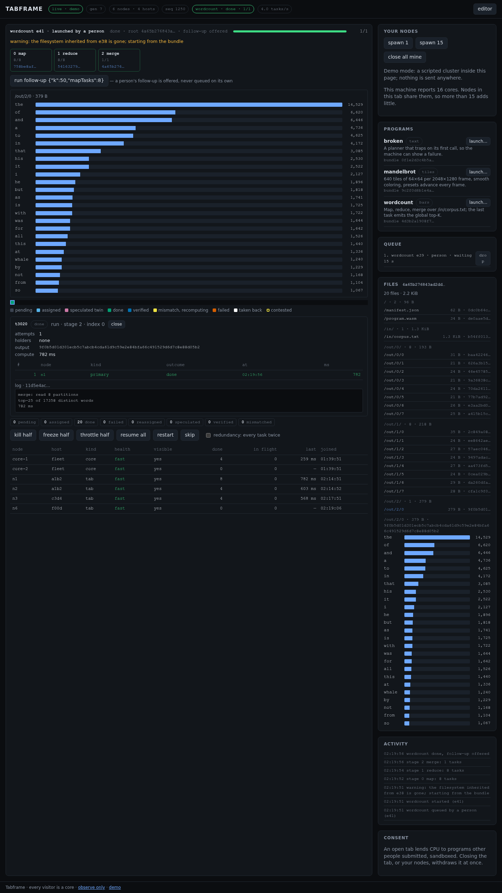

# WP2.5 — Dashboard v2

**Milestone:** M2 · **Branch:** `wp/2.5-dashboard-v2` · **Merged:** pending · **Packages:**
`packages/web`, `packages/protocol` (one optional field), `e2e`

## What

The dashboard grew the panels the plan lists for v2 (design §5.1, §6.7, §8.3), all fed by the
observer socket and the store, none by a new HTTP route (D18).

- **Programs panel.** Every program the machine can run, from the snapshot's `programs` list
  (bundle, name, view, description, default params) and from `programAdded` for uploads that
  arrive later. Each row has a launch form: the params prefilled from the manifest's defaults,
  validated as a JSON object before anything leaves the page, sent as `launch {bundle, params}`.
  The program whose execution is running is marked.
- **Queue.** Position, program, execution id, whether a person or the loop queued it, how long it
  has waited, and a **drop** button (`killExecution`) per entry. The running execution gets a
  **kill execution** button among the cluster controls.
- **Stage strip.** One chip per stage of the current execution — index, name, done/total, failed
  count, status colour — plus a dashed chip for the planning step between stages, naming the
  node running the planner. A chip's root hash is a link: clicking it browses the filesystem as it
  was after that stage. A page that joined mid-execution sees the earlier stages as folded and
  unnamed; the snapshot does not carry their names, and the strip says "before this page joined"
  rather than inventing them.
- **`bars` and `text` views.** When a non-tiles execution finishes, the page fetches its root
  manifest from the store, finds the single output of the last stage, fetches it, and draws it:
  bars longest first, scaled to the widest, values with thousands separators, capped at forty
  rows; text raw in a `<pre>`, capped at 64 KiB. While the execution runs, the view says which
  stage is in progress and that the result appears when the last stage folds. A last stage with
  several outputs is not guessed at; the files panel has them.
- **Files panel.** The manifest behind `execution.root` (or a root chosen from the strip), listed
  by path with sizes and short hashes, grouped: the bundle's two fixed files, `/in/`, each stage's
  `/out/<stage>/`, then anything else. Clicking a file previews it by content: a `TFBR` payload as
  bars, text as text, a nested manifest as a list, RGBA of the execution's tile size as an image,
  anything else as a hex head.
- **Task detail.** A click on a grid cell — or on a tile of the canvas — opens the task: id,
  kind, stage, index, placement, output hash, compute time, contested and verified marks, failure
  reason, and an attempts table: every attempt the event stream told of, with the node, whether it
  was a primary or a speculative twin, its outcome (running, done, verified, released, mismatch,
  retracted, cancelled, failed), when, and how long. The log is shown inline when the wire carried
  text, fetched from the store when it carried a hash, and named as absent when the wire carried
  nothing. A second click clears the selection; the selected task is outlined in blue on the grid
  and on the canvas.
- **Failure surfacing.** `executionFailed` fills a banner under the execution row with the program,
  execution id, reason, and time; it stays until an execution succeeds (the machine has moved on
  and it worked) or the reader dismisses it, so a failure that happened between two glances is
  still there. `executionWarning` lists under the execution row as long as that execution is
  shown. The result view says "no result: …" for a failed non-tiles run.
- **Demo mode** cycles through three programs instead of one: the Mandelbrot frame with its
  dashboard-v1 story, a **word count** (three stages of 8, 8, and 1 tasks; a bundle with a corpus
  under `/in/`; a folded manifest per stage stored under its true hash; map partitions as text,
  the merge as a real bars payload of Moby-Dick's top 25; an `executionWarning` about an expired
  inherited root; a log per task, the merge's as a blob), and a **broken** program whose planner
  traps, so the failure banner has something to show. `?program=<name>` starts the cycle there and
  `?hold=1` pauses after the first execution ends, which is how the browser tests and screenshots
  land on a finished result. A launch from the programs panel in demo mode queues that program
  next.

## How

- **The reducer** (`state.ts`) gained: `programs` as full records (view null until a snapshot
  describes an announced program); per-execution `stages` with tallies kept from `taskDone` and
  `taskFailed`, roots from `stageDone`, statuses from the execution's end; per-task `history`
  (capped at sixteen) built from the six task events, with the core's semantics mirrored —
  `taskDone` closes the winner and cancels its twin, `taskReassigned` releases, `taskMismatch`
  retracts the accepted and marks the disagreeing node, `taskVerified` records a node the page never
  saw take the task; `warnings`; `lastFailure`. Snapshot rows reconstruct running attempts from
  their holders and say so (`fromSnapshot`).
- **Pure helpers** (`result.ts`): manifest parsing, path order that sorts `/out/0/2` before
  `/out/0/10`, grouping, `finalOutput`, bars decoding and scaling, text detection, and the preview
  classifier. All unit-tested under Bun.
- **Panels** (`panels.ts`) render from state; each panel redraws only when a signature of what it
  shows has changed, so a button stays the same node under a finger between renders — the page
  renders four times a second when the cluster is quiet, and a rebuilt button is a click that
  lands on nothing. Blobs go through a small cache that fetches each hash once and asks for a
  render when a fetch settles.
- **`[hidden] { display: none !important }`** joined the stylesheet. An element whose class sets
  `display: flex` is not hidden by the `hidden` attribute otherwise; the failure banner and the
  strip were the first panels to find out.
- **Protocol.** `taskDone.log` and `taskView.log`, optional and nullable, the same shape the node's
  `result` message already carries. The core does not forward it yet (see open items); the
  dashboard handles both cases and the demo exercises both forms.
- **Grid geometry** moved to `gridLayout`/`gridIndexAt` so the drawing and the click handler cannot
  disagree about where a cell is.

## Evidence

- `bun test`: 445 pass across the repository, 94.6 % of measured lines; `packages/web` adds 18
  tests — `state.test.ts`: programs from the snapshot and from announcements, the strip through
  plan → stage → fold → plan → stage → done, a mid-execution snapshot's unknown stages, a task's
  history through twins, releases, retractions and failures, the history cap and snapshot
  reconstruction, the log on `taskDone`, a dropped queue entry leaving the queue without a
  banner, warnings and the failure kept until a success;
  `result.test.ts`: path order, grouping, manifest parsing, the final output rule, bars, text,
  previews, formatting. `packages/protocol` adds the log's shapes and caps.
- Playwright: 12 pass, three new in `e2e/panels.e2e.ts`. Demo: the word count's three stages,
  tallies, the warning, 25 bars with "the" first at 14,529, the files panel's five groups, a text
  preview, a bars preview, browsing stage 0's root and following the execution again, task detail
  with one primary attempt and the merge's log fetched by hash, selection cleared by a second click.
  Demo: the broken program's banner with the trap, `no result`, dismiss. Live, against the local
  control plane: an uploaded module appears in the programs panel with a launch form, the running
  execution is marked and shows in the strip, kill from the page produces the "cancelled by an
  operator" banner, a launch from the panel with edited params is queued by a person and runs, a
  second launch queues behind it and drops from the queue, bad params never leave the page.
- Lint: no findings in the touched packages; the three type-check projects are clean.

## Dependencies introduced

None.

## Drift

- The `taskDone` event and the task view carry an optional `log`, the shape the node already
  reports. Recorded in the design's drift log.
- The browser suites run on one worker (`workers: 1`): they share one local control plane and,
  since WP2.3, the editor's launch test really launches. That test now kills its execution from
  the page before it ends, so the suites after it find the machine idle.
- The `bars` view draws the single output of the last stage only.

## Open items for the parent

- **Forward the log.** The core's `ResultRecord` keeps the accepted result's `log`; `taskDone`
  in `packages/core/src/results.ts` and `taskView` in `ledger.ts` do not pass it on. One field
  each and the detail panel lights up; the dashboard already says "not carried on the wire yet".
- **`programAdded` could carry the view, description, and default params.** A program announced
  after the page's snapshot shows "view unknown" until the next snapshot; the core has the manifest
  in hand when it emits the event.
- **Stage history in the snapshot.** A page that joins mid-execution sees earlier stages as folded
  and unnamed. A `stages` list on the execution view would fill the strip.
- **A dropped module is named after its file** in the editor (`program.wasm` → `program`), so an
  upload without an edited name shows up under that name. The test fills the name; the editor
  might warn.
- Follow-ups of a person's execution are offered with a `run follow-up` button (D19); it sends
  `runFollowUp`, which the demo answers with an error since it has no follow-up path.
